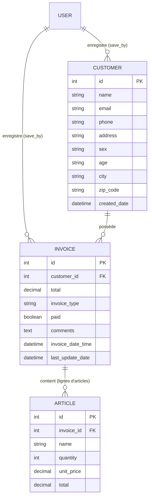

# Documentation Technique & Guide d'Utilisation - Système de Facturation Django

Ce projet est une application web professionnelle de gestion et de génération de factures développée avec le framework **Django**. Elle permet de gérer les clients, de composer des factures avec des lignes d'articles dynamiques, et de générer/télécharger instantanément des documents **PDF** prêts à l'impression.

---

## Sommaire
1. [Architecture Globale](#1-architecture-globale)
2. [Modèles de Données](#2-modèles-de-données)
3. [Fonctionnalités Clés](#3-fonctionnalités-clés)
4. [Explication Détaillée des Vues et du Code](#4-explication-détaillée-des-vues-et-du-code)
5. [Moteur de Génération PDF](#5-moteur-de-génération-pdf)
6. [Installation et Démarrage](#6-installation-et-démarrage)
7. [Exécution des Tests Automatisés](#7-exécution-des-tests-automatisés)
8. [Guide Utilisateur Pas à Pas](#8-guide-utilisateur-pas-à-pas)

---

## 1. Architecture Globale

Le projet suit l'architecture classique **MVT (Modèle - Vue - Template)** de Django :

```text
FACTURATION_DJANGO/
│
├── django_invoice/          # Configuration principale du projet Django
│   ├── settings.py          # Paramètres (Apps, Middleware, Templates, Base SQLite)
│   ├── urls.py              # Routage principal
│   └── wsgi.py              # Point d'entrée serveur WSGI
│
├── fact_app/                # Application principale de facturation
│   ├── models.py            # Modèles Customer, Invoice, Article
│   ├── views.py             # Vues (HomeView, AddCustomerView, AddInvoiceView, etc.)
│   ├── urls.py              # URLs spécifiques à la facturation
│   ├── utils.py             # Fonctions utilitaires (PDF, pagination, sécurité)
│   ├── tests.py             # Tests unitaires et d'intégration
│   └── static/              # Fichiers CSS et assets visuels
│
├── templates/               # Gabarits HTML de l'interface
│   ├── base.html            # Gabarit maître (Navbar, Bootstrap, Messages flash)
│   ├── index.html           # Tableau de bord et liste des factures
│   ├── add_customer.html    # Formulaire de création de client
│   ├── add_invoice.html     # Formulaire dynamique de facture
│   ├── invoice.html         # Vue détaillée de la facture à l'écran
│   └── invoice_pdf.html     # Gabarit HTML/CSS print-ready pour l'export PDF
│
├── db.sqlite3               # Base de données SQLite locale
└── manage.py                # Utilitaire de commande Django
```

---

## 2. Modèles de Données

Le système repose sur 3 entités interconnectées définies dans `fact_app/models.py` :



### Détail des modèles :
- **Customer** : Stocke les coordonnées du client (nom, email, téléphone, adresse, ville, code postal, genre et tranche d'âge).
- **Invoice** : Représente l'en-tête de la facture (client rattaché, type : Reçu/Proforma/Facture, montant global, état payé ou impayé, commentaires, date d'émission).
- **Article** : Représente chaque ligne d'article liée à une facture (nom, quantité, prix unitaire, sous-total calculé).

---

## 3. Fonctionnalités Clés

1. **Tableau de Bord & Gestion des Factures** :
   - Liste ordonnée de la plus récente à la plus ancienne avec pagination (5 par page).
   - Recherche en temps réel via JavaScript (filtrage instantané sur client, date, type).
   - Modification rapide du statut (Payé / Impayé) via modale Bootstrap.
   - Suppression sécurisée d'une facture et de ses articles avec avertissement.

2. **Création Dynamique de Factures** :
   - Sélection du client et du type de document.
   - Ajout et suppression dynamiques de lignes d'articles via jQuery sans rechargement de page.
   - Calcul automatique et instantané du sous-total par ligne (`quantité × prix unitaire`) et du total général.

3. **Double Mode d'Enregistrement** :
   - **Enregistrer** : Crée la facture et redirige vers la vue détaillée.
   - **Enregistrer & Télécharger PDF** : Crée la facture, redirige vers la vue détaillée et déclenche **automatiquement** le téléchargement du fichier PDF dans le navigateur.

4. **Téléchargement PDF 100% Autonome** :
   - Génération de PDF professionnelle via `xhtml2pdf` (moteur ReportLab purement Python).
   - Ne nécessite **aucun exécutable externe** (tel que wkhtmltopdf) sur le serveur ou le PC Windows.

---

## 4. Explication Détaillée des Vues et du Code

### `HomeView` (dans `fact_app/views.py`)
- **GET** : Exécute une requête optimisée `Invoice.objects.select_related('customer', 'save_by')` pour récupérer toutes les données en limitant les requêtes SQL, puis découpe les résultats via `pagination()`.
- **POST** : Modifie le statut `paid` ou supprime la facture sélectionnée, puis applique le patron **Post-Redirect-Get** (`redirect('home')`) pour éliminer tout risque de double soumission lors du rechargement du navigateur.

### `AddCustomerView`
- **GET** : Affiche le formulaire `add_customer.html`.
- **POST** : Nettoie les données saisies, résout l'utilisateur responsable via `get_current_user(request)` (ce qui protège contre les erreurs lorsque la session n'est pas authentifiée), crée le client et redirige vers la page d'accueil avec un message de succès.

### `AddInvoiceView`
- **GET** : Interroge la base pour charger la liste à jour de tous les clients dans la liste déroulante.
- **POST** : Enveloppé dans un décorateur `@transaction.atomic` (si une ligne d'article échoue, rien n'est créé en base).
  - Récupère l'action : `'save'` ou `'save_and_download'`.
  - Instancie l'objet `Invoice`.
  - Parcourt les tableaux `article[]`, `qty[]`, `unit[]` pour construire les objets `Article`.
  - Exécute un `Article.objects.bulk_create(items)` pour insérer toutes les lignes d'un coup.
  - Si l'action est `save_and_download`, redirige vers `view-invoice/<id>?download=1`.

### `InvoiceVisualizationView`
- Récupère la facture et tous ses articles via `get_invoice(pk)`.
- Affiche la facture dans un gabarit esthétique (`invoice.html`) avec les boutons d'action (Imprimer, Télécharger PDF, Retour).
- Si le paramètre `?download=1` est présent dans l'URL, un script JavaScript lance automatiquement le téléchargement du fichier PDF en arrière-plan sans bloquer l'affichage.

### `get_invoice_pdf`
- Appelle `generate_pdf('invoice_pdf.html', context)`.
- Envoie le flux binaire avec l'en-tête HTTP :
  `Content-Disposition: attachment; filename="facture_<Client>_<ID>.pdf"`.

---

## 5. Moteur de Génération PDF

Pour garantir la portabilité sous Windows, Linux et macOS sans dépendances logicielles externes, le projet utilise **`xhtml2pdf`** :

```python
def generate_pdf(template_name, context):
    template = get_template(template_name)
    html = template.render(context)
    result = BytesIO()
    pdf = pisa.pisaDocument(BytesIO(html.encode("UTF-8")), result)
    if not pdf.err:
        return result.getvalue()
    return None
```

Le gabarit `templates/invoice_pdf.html` a été spécialement conçu avec des règles CSS d'impression `@page` :
- Format de page A4 portrait avec marges calibrées (1.5cm).
- Typographie vectorielle nette (Helvetica, Arial).
- Disposition en tableaux HTML stables pour une compatibilité parfaite avec les moteurs PDF.
- Badge vert `PAYÉ` ou rouge `IMPAYÉ` stylisé en CSS.
- Numérotation automatique des pages en bas à droite.

---

## 6. Installation et Démarrage

### Prérequis
- Python 3.10 ou supérieur installé sur la machine.
- L'environnement virtuel du projet (`monenv`).

### Activation de l'environnement virtuel (Windows PowerShell) :
```powershell
.\monenv\Scripts\Activate.ps1
```

### Installation des dépendances requises :
```powershell
pip install Django xhtml2pdf
```

### Application des migrations :
```powershell
python manage.py migrate
```

### Lancement du serveur de développement :
```powershell
python manage.py runserver 127.0.0.1:8000
```

L'application est ensuite accessible sur :
- **Application :** [http://127.0.0.1:8000/](http://127.0.0.1:8000/)
- **Administration Django :** [http://127.0.0.1:8000/admin/](http://127.0.0.1:8000/admin/)

---

## 7. Exécution des Tests Automatisés

Une suite complète de tests de non-régression est disponible dans `fact_app/tests.py`. Elle valide :
1. Le chargement de la page d'accueil.
2. L'enregistrement d'un client et la redirection.
3. La création d'une facture complète avec calculs et téléchargement du PDF binaire valide.
4. La mise à jour du statut de paiement et la suppression.

Pour lancer les tests à tout moment :
```powershell
python manage.py test
```

Résultat attendu :
```text
Creating test database for alias 'default'...
....
----------------------------------------------------------------------
Ran 4 tests in 3.8s

OK
Destroying test database for alias 'default'...
```

---

## 8. Guide Utilisateur Pas à Pas

### Étape 1 : Enregistrer un client
1. Cliquez sur **« + Nouveau Client »** depuis la barre de navigation ou la page d'accueil.
2. Remplissez le nom, téléphone, adresse, email et ville.
3. Cliquez sur **« Enregistrer le client »**. Vous êtes redirigé vers l'accueil.

### Étape 2 : Créer une facture
1. Cliquez sur **« + Nouvelle Facture »**.
2. Sélectionnez le client dans la liste déroulante.
3. Choisissez le type de document (*Reçu*, *Facture Proforma*, ou *Facture Définitive*).
4. Saisissez la désignation du premier article, sa quantité et son prix unitaire.
5. Utilisez le bouton **« + Ajouter une ligne »** pour insérer d'autres articles. Les totaux se recalculent automatiquement.
6. Deux options s'offrent à vous en bas de page :
   - **Enregistrer** : Pour enregistrer la facture et la consulter à l'écran.
   - **Enregistrer & Télécharger PDF** : Pour enregistrer la facture et **lancer immédiatement le téléchargement de votre fichier PDF**.

### Étape 3 : Téléchargement ultérieur
- Depuis la page d'accueil, cliquez sur le bouton bleu **« PDF »** présent sur chaque ligne du tableau pour télécharger directement n'importe quelle facture existante.
- Vous pouvez également cliquer sur **« Voir »**, puis sur le bouton **« Télécharger PDF »** situé en haut de la facture.
